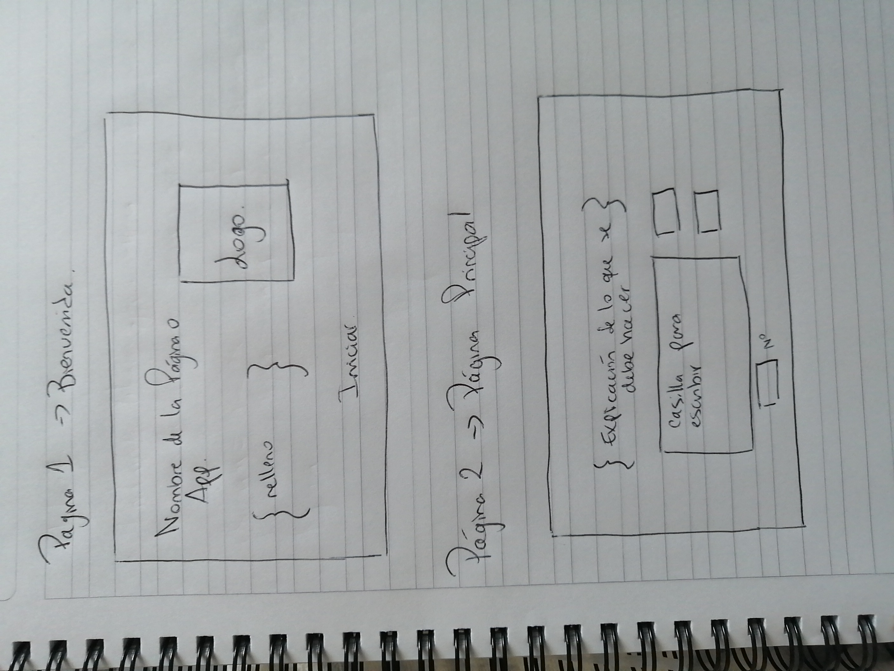
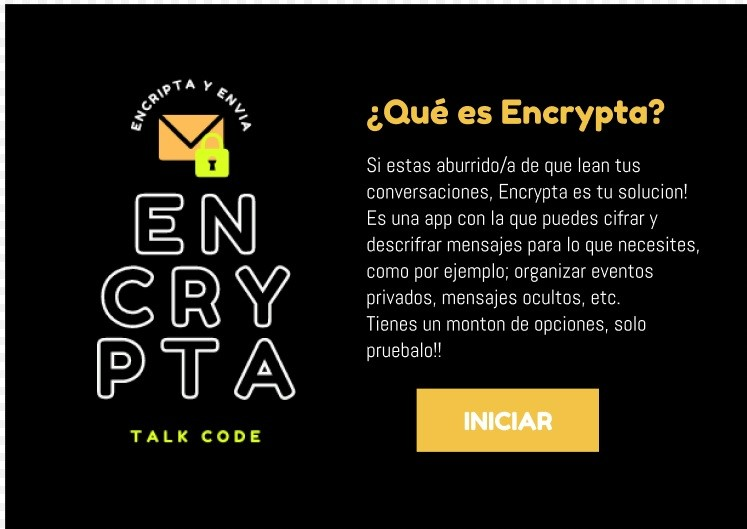
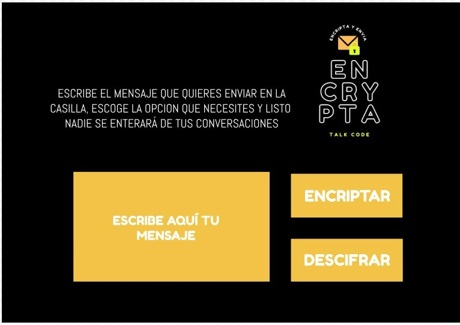

# CIFRADO CÉSAR

## NUESTRO PROYECTO / ENCRYPTA

Encrypta es una aplicacion web que nos ayuda a cifrar y descifrar cualquier tipo de mensaje que queramos entregar. Esto nos ayuda a dar privacidad en este mundo conectado en donde corremos el riesgo de que nuestras conversaciones, eventos y mucha información, sea expuesta a través de internet o simplemente con personas "entrometidas". Esta app nos da la ventaja de hacer todo eso, mucho más seguro.

### Definición del producto

Este proyecto fue pensado para que usuarios tengan la posibilidad de poder Cifrar y descifrar mensajes para resguardar información importante, especialmente para realizar eventos privados, manifestaciones, etc. Cualquier organización que requiere resguardar cierta información pero no quisimos apuntar solo a un segmento puntual, además que esto se puede prestar a crear ciertos "conflictos", por ende quisimos realizar algo más generico o global y pensamos en Encrypta para que puedan resguardar cualquier conversación que ameriten.

#### * Usuarios
Nuestros principales usuarios son jóvenes y adultos. Mencionamos que no solo puntamos a un segmento en especial por ende sabemos que esta App puede abarcar a un gran grup etario, simplemente puede estar más familiarizado con gente joven y adulta.

#### * Objetivos de usuario
El principal objetivo es resguardar esta información para que no se vaya a filtrar o exponer y esto pueda causar conflictos, ya sea en la realización del evento o en conversaciones privadas.

#### * Resolviendo problemas
Creemos que esta App ayudaría bastante a realizar eventos de una manera más segura y efectiva, sin el temor de que se pueda exponer o confundir a la multitud con información falsa ya que todo estaría resguardado.
Sucederia de manera similar con conversaciones privadas ya que evitariamos ciertos conflictos que muchas veces ocurren por "revelar" información que queremos ocultar.

## UX

#### * Ideación
Nuestra idea se basó en hacer algo simple que no nos costará despues llevarlo a código ni nos diera mayor problemas, por eso solo pensamos en hacer dos páginas, una principal y otra de bienvenida. Ideamos en ocultar con Display: Block / None.
Quisimos desarrollar un logo para darle un sello único.

#### * Prototipado (Sketching)
Hicimos un prototipo en papel apegandonos a esta idea "simple", sacamos ideas de otras páginas para guiarnos un poco y llegamos a la conclusión de que esto sería lo mejor.

Luego realizamos nuestro prototipo en Figma, el cual nos ayudó a saber que color o fuentes de texto utilizariamos, los botones de nuestra página, etc. Además creamos nuestro logo en Canvas.

#### * Testeo e Iteración de Bosquejo 
Finalmente nos apegamos bastante al diseño original de nuestra idea y prototipo, recibimos algunos Feedbacks de los cuales destacaron lo simple pero bonita de nuestra página y el Logo que les gustó bastante, por ende no tuvimos la necesidad de realizar cambios significativos en nuestra App más que cambios en la fuente de las letras o colores.
En cuanto a la página, nos guiamos por el diseño realizado en Figma. Muchas veces nos dificultó seguir el prototipo pero finalmente lo logramos quedando muy parecido a la idea principal.

## PÁGINA WEB

### Página de Bienvenida

Nuestra primera página da la bienvenida a Encrypta y nos da un breve resumen de cuales son algunas funciones que realiza la app y los invita a realizar esta prueba de Cifrar y Encriptar un mensaje con el fin que ellos estimen convenientes. Tiene el logo como imagen principal para que destaque el nombre delm proyecto.
Contamos con un botón de "Iniciar", esto nos da el pase a la segunda página que es la principal donde podremos probar la aplicación.
Para poder realizar esta función, utilizamos Display (None) para ocultar la página principal y le dimos una Función al boton de "Iniciar" para que cuando el usuario hiciera "click", este ocultara la Pagina de bienvenida y mostrara la principal; Display (Block).

### Página Principal

Esta página contiene una "section" y un "aside". La "section" es el espacio donde presentamos  una breve introducción de lo que se debe hacer la usuaria/o para efectuar el cifrado o descifrado del mensaje. Luego, utilizamos un "input type number" para introducir el número de desplazamiento que la usaria/o decida para el cifrado de su mensaje. Por último, dentro de la parte section, aparece un espacio donde se escribirá el mensaje que la usaria/o quiera cifrar o descifrar.
En la parte del "aside" incluimos el logo de Encrypta y abajo los dos botones: "cifrar" y "descifrar". Estos botones los introdujimos con dos etiquetas "button" y son los que se encargan de cifrar o descifrar el mensaje que ingrese la usuaria/o.

### Conclusión
Nuestra aplicación web Encrypta, logra cifrar o descifrar mensaje para cualquier usario o usaria quien quieran proteger la privacidad de sus mensajes.

